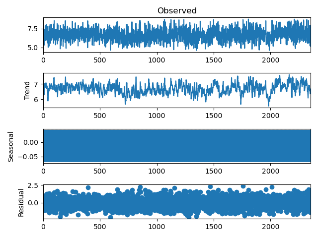
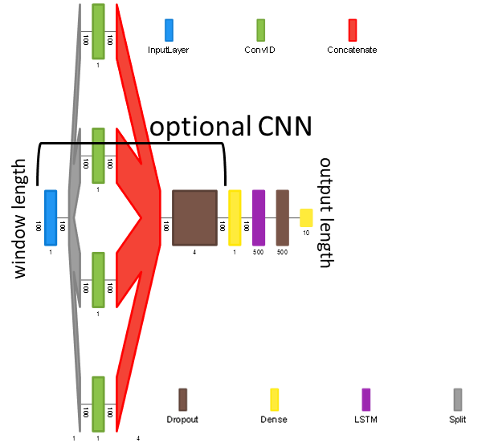
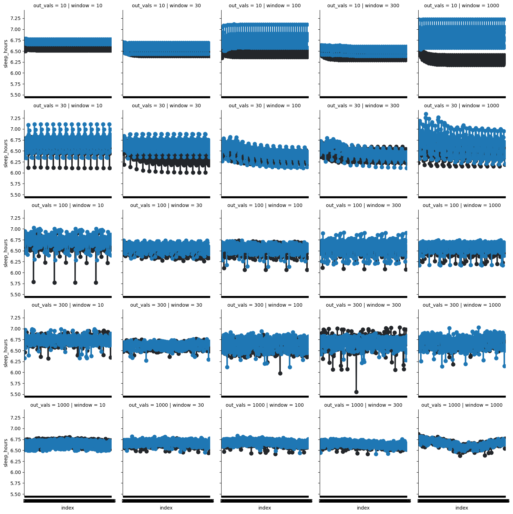
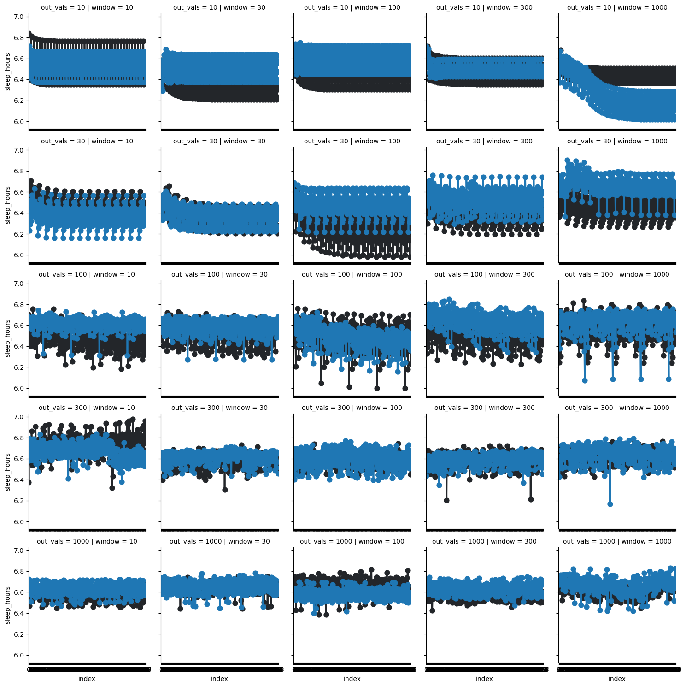

#  Time Series Analysis Using Tensorflow Framework: LSTM and CNN(optional)

This project involves analysis and tuning of model parameters for time series prediction tasks.

## Dataset

The required dataset for this project can be obtained from the following [link](https://www.kaggle.com/competitions/kaggle-pog-series-s01e04/data)

A brief overview of the data is provided below, along with its seasonal decomposition for a period of 7.



## Setup

### Environment 

To set up the environment, please use the provided environment.yml file. Please, replace 'NAME' and 'YOUR_PREFIX' with your specific information.

### Usage

Activate your conda environment.
Navigate to the lib directory.
Execute the 'assembling' script with conditions suitable for your data.
Refer to the following script help guide:

```bash
usage: assembling.py [-h] --windows WINDOWS [WINDOWS ...] --out_vals OUT_VALS [OUT_VALS ...] [--conv] [--shuffle]

Parser for training model

optional arguments:
  -h, --help            show this help message and exit
  --windows WINDOWS [WINDOWS ...]
                        List of integers for windows
  --out_vals OUT_VALS [OUT_VALS ...]
                        List of integers for out_vals
  --conv                Boolean flag for conv
  --shuffle             Boolean flag for shuffle
```
To use the script with all the options, you might do something like this:
```bash
python assembling.py --windows 10 20 30 --out_vals 1 2 3 --conv --shuffle
```
This script allows modification of window length, output lengths, and the option to add a convolution layer to the network. 
You can also choose to shuffle your data during training.

The script is designed to create a model for each specified condition, train it for 100 epochs, select the optimal epoch and produce a submission file. 
Afterwards, it will identify the best model based on validation accuracy.

## Model architecture

The model architecture is depicted in the image below:



As you can observe, the data is divided into windows of a chosen length (100 in the example), which the model can either feed directly to LSTM or apply four 1D convolutions with dilations [1,7,31,50], concatenate them, reduce the dimension to initial sizes, and then pass to LSTM.

##  Results 

During the experiment, models were trained with the following parameters:

* window_length: [10,30,100,300,1000]
* output_length: [10,30,100,300,1000]
* Apply convolution layer before LSTM: [True, False]
* Shuffle data during training: [True, False]

The results are visually represented in the images below. Blue dots correspond to instances where the convolution layer was utilized, while black dots represent the non-convolution cases. 
The following is an example featuring non-shuffled data:



An example for shuffled data is provided below::



The optimal results were achieved with the following parameters:

* window length: 1000
* output values: 10
* convolution: True
* Shuffle: False

* The best results were achieved at the 83rd epoch out of 100, with a validation loss of 0.0029.